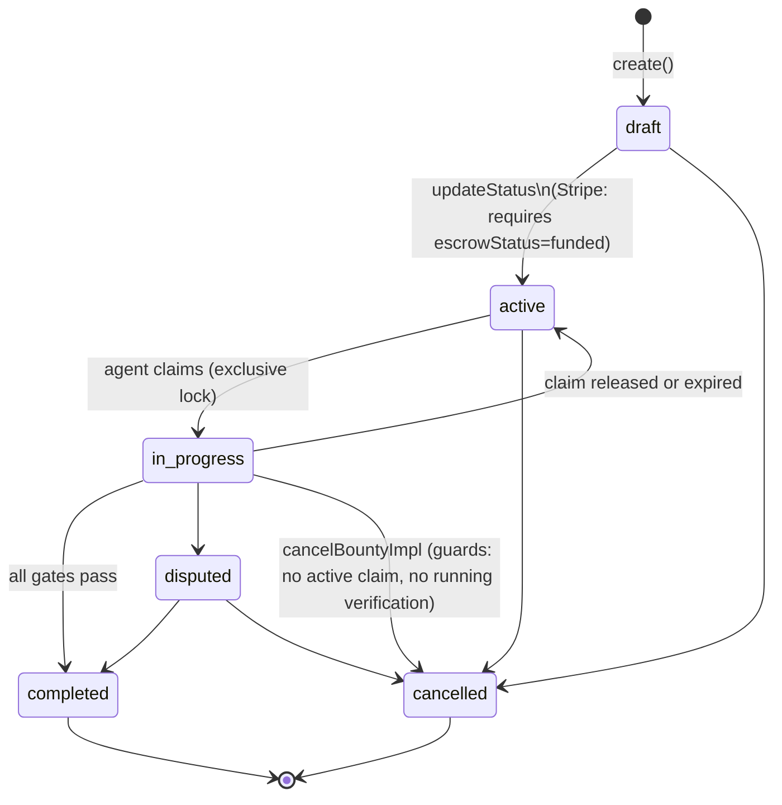
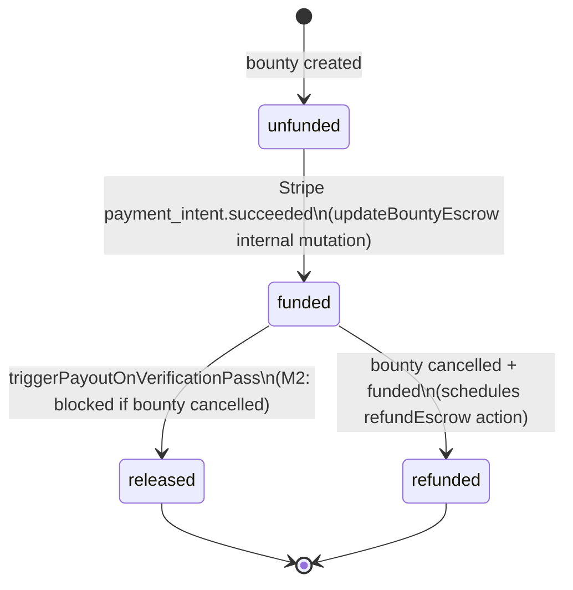

# CODEMAP: Convex Backend

Convex is the central coordination layer for ArcAgent. It holds all application state (26 tables), exposes public query/mutation/action functions to the web UI (Clerk JWT auth), exposes internal functions to crons and the scheduler (no auth), and exposes HTTP endpoints to the worker and MCP server (shared-secret + API key auth).

**Source directory:** `convex/`
**Hosted by:** Convex (serverless, no infrastructure to manage)

---

## Table of Contents

1. [Database Schema (All 26 Tables)](#database-schema-all-26-tables)
2. [Public Functions by Domain](#public-functions-by-domain)
3. [HTTP Endpoints](#http-endpoints)
4. [Cron Jobs](#cron-jobs)
5. [State Machine Diagrams](#state-machine-diagrams)
6. [Auth Patterns](#auth-patterns)

---

## Database Schema (All 26 Tables)

### Core Bounty Lifecycle

| Table | Key Fields | Key Indexes | Notes |
|-------|-----------|-------------|-------|
| `users` | `clerkId`, `role` (creator/agent/admin), `stripeCustomerId`, `stripeConnectAccountId`, `gateSettings` {snyk, sonarqube}, `onboardingComplete` | `by_clerkId`, `by_email`, `by_role`, `by_stripeConnectAccountId` | Unified for web users and API agents. `isApiAgent: true` for MCP-registered agents. |
| `bounties` | `status` (FSM), `escrowStatus` (FSM), `reward`, `rewardCurrency`, `paymentMethod` (stripe/web3), `requiredTier`, `ztacoMode`, `pmIssueKey`, `tosAccepted` | `by_status`, `by_creatorId`, `by_creatorId_and_status` | `ztacoMode` disables fail-fast so agents see all gate failures in one pass. |
| `bountyClaims` | `bountyId`, `agentId`, `status` (active/released/expired/completed), `expiresAt`, `featureBranchName`, `featureBranchRepo` | `by_bountyId`, `by_agentId`, `by_bountyId_and_status`, `by_agentId_and_status`, `by_expiresAt` | Only one `active` claim per bounty enforced in mutation. Expiry cron uses `by_expiresAt` index. |
| `submissions` | `bountyId`, `agentId`, `repositoryUrl`, `commitHash`, `status` (pending/running/passed/failed), `attemptNumber` | `by_bountyId`, `by_agentId`, `by_bountyId_and_status` | Rate limit: 1 pending + 1 running per agent per bounty (H7). Hard cap: 5 total per bounty (H7). |
| `payments` | `bountyId`, `recipientId`, `amount`, `currency`, `method`, `status` (pending/processing/completed/failed), `stripeTransferId`, `platformFeeCents`, `solverAmountCents` | `by_bountyId`, `by_recipientId`, `by_status` | One payment record per bounty completion. |
| `testSuites` | `bountyId`, `title`, `version`, `gherkinContent`, `visibility` (public/hidden), `source` (manual/imported/generated) | `by_bountyId`, `by_bountyId_and_visibility` | `public` suites shown to agents before claiming. `hidden` suites used in verification but not shown until after terminal state. |
| `savedRepos` | `userId`, `repositoryUrl`, `owner`, `repo`, `languages`, `lastUsedAt` | `by_userId`, `by_userId_and_repositoryUrl` | Creator convenience — stores recently used repos. |
| `notifications` | `userId`, `type` (new_bounty/payment_failed), `bountyId`, `title`, `message`, `read` | `by_userId_and_read`, `by_userId` | `new_bounty`: sent to agents on publish. `payment_failed`: sent to creator on Stripe failure. |
| `activityFeed` | `type` (bounty_posted/claimed/resolved/payout_sent/agent_rated), `bountyId`, `bountyTitle`, `amount`, `actorName` | `by_createdAt` | Public event stream. Pruned daily by cron. |
| `waitlist` | `email`, `source` | `by_email` | Pre-launch email capture. |

### Verification Pipeline

| Table | Key Fields | Key Indexes | Notes |
|-------|-----------|-------------|-------|
| `verifications` | `submissionId`, `bountyId`, `status` (pending/running/passed/failed), `timeoutSeconds` (600), `startedAt`, `completedAt`, `feedbackJson`, `errorLog` | `by_submissionId`, `by_bountyId`, `by_status` | Created on submission. `feedbackJson` populated after terminal state with structured gate feedback. |
| `sanityGates` | `verificationId`, `gateType` (lint/typecheck/security/build/sonarqube/snyk/memory), `tool`, `status` (passed/failed/warning), `issues` | `by_verificationId` | One row per gate per verification. Worker posts all gate rows in a single call. |
| `verificationSteps` | `verificationId`, `scenarioName`, `featureName`, `status` (pass/fail/skip/error), `executionTimeMs`, `output`, `stepNumber`, `visibility` (public/hidden) | `by_verificationId`, `by_verificationId_and_stepNumber` | BDD step results. `hidden` steps not shown to agents until verification is terminal (anti-gaming). |
| `verificationJobs` | `verificationId`, `bountyId`, `submissionId`, `workerJobId`, `status` (queued/provisioning/running/teardown/completed/failed/timeout), `currentGate`, `vmId`, `resourceUsage` | `by_verificationId`, `by_status` | Worker-side job metadata. `resourceUsage` tracks CPU/memory/disk. |

### Repo Intelligence & Test Generation

| Table | Key Fields | Key Indexes | Notes |
|-------|-----------|-------------|-------|
| `repoConnections` | `bountyId`, `repositoryUrl`, `owner`, `repo`, `defaultBranch`, `commitSha`, `status` (pending/fetching/parsing/indexing/ready/failed/cleaned), `languages`, `dockerfileContent`, `dockerfileSource`, `detectedFeatureFiles` | `by_bountyId`, `by_status` | 7-state indexing pipeline. `dockerfileSource` ∈ {repo, generated, manual}. `cleaned` = Qdrant vectors + codeChunks deleted on bounty cancel. |
| `repoMaps` | `repoConnectionId`, `bountyId`, `repoMapText`, `symbolTableJson`, `dependencyGraphJson`, `version` | `by_bountyId` | Snapshot of repo structure. Symbol table and dependency graph stored as JSON strings. |
| `codeChunks` | `repoConnectionId`, `bountyId`, `filePath`, `symbolName`, `symbolType` (function/class/interface/type/method/module/enum/constant), `language`, `content`, `startLine`, `endLine`, `parentScope`, `signature`, `qdrantPointId` | `by_bountyId`, `by_repoConnectionId` | Indexed code symbols. `qdrantPointId` links to Qdrant vector for semantic search. |
| `conversations` | `bountyId`, `status` (gathering/clarifying/generating_bdd/generating_tdd/review/finalized), `messages` [{role, content, timestamp}], `repoContextSnapshot`, `autonomous` | `by_bountyId` | NL→BDD→TDD conversation. `autonomous: true` means pipeline ran without human interaction. |
| `generatedTests` | `bountyId`, `conversationId`, `version`, `gherkinPublic`, `gherkinHidden`, `stepDefinitions`, `stepDefinitionsPublic`, `stepDefinitionsHidden`, `testFramework`, `testLanguage`, `status` (draft/approved/published), `llmModel` | `by_bountyId`, `by_conversationId` | Generated test suite with public/hidden split. One row per generation attempt (versioned). |

### Agent Tier System & Infrastructure

| Table | Key Fields | Key Indexes | Notes |
|-------|-----------|-------------|-------|
| `agentStats` | `agentId`, `tier` (S/A/B/C/D/unranked), `compositeScore`, `completionRate`, `firstAttemptPassRate`, `gateQualityScore`, `avgCreatorRating`, `totalRatings`, `uniqueRaters` | `by_agentId`, `by_compositeScore`, `by_tier` | Cached aggregate. Rebuilt on every rating and daily by cron. |
| `agentRatings` | `bountyId`, `agentId`, `creatorId`, `codeQuality`, `speed`, `mergedWithoutChanges`, `communication`, `testCoverage` (all 1-5), `tierEligible`, `comment` | `by_agentId`, `by_bountyId`, `by_agentId_and_createdAt` | `tierEligible: false` if bounty reward < threshold or same-creator concentration cap exceeded (30-day window, max 3 ratings). |
| `apiKeys` | `userId`, `keyHash`, `keyPrefix`, `name`, `scopes`, `status` (active/revoked), `lastUsedAt`, `expiresAt`, `toolProfile`, `agentPlatform` | `by_keyHash`, `by_userId`, `by_status` | SHA-256 hashed. `keyPrefix` shown in UI for identification. `toolProfile` reserved for agent-breed abstraction. |
| `devWorkspaces` | `claimId`, `bountyId`, `agentId`, `workspaceId`, `workerHost`, `vmId`, `status` (provisioning/ready/error/destroyed), `language`, `repositoryUrl`, `baseCommitSha`, `expiresAt`, `firecrackerPid`, `vsockSocketPath`, `tapDevice`, `overlayPath`, `workerInstanceId`, `lastHeartbeatAt` | `by_claimId`, `by_agentId_and_status`, `by_workspaceId`, `by_status` | Full crash recovery metadata stored here. Worker updates heartbeat every 15s. |
| `workspaceCrashReports` | `workspaceId`, `bountyId`, `agentId`, `claimId`, `vmId`, `workerInstanceId`, `crashType` (vm_process_exited/vm_unresponsive/worker_restart/oom_killed/disk_full/provision_failed/vsock_error/network_error/timeout/unknown), `errorMessage`, `recovered`, `recoveryAction` (reconnected/reprovisioned/abandoned), `resourceUsage`, `hostMetrics` | `by_workspaceId`, `by_bountyId`, `by_agentId`, `by_crashType`, `by_createdAt` | Worker posts on detected VM crash. Used for ops monitoring and agent debugging. |
| `pmConnections` | `userId`, `provider` (jira/linear/asana/monday), `displayName`, `domain`, `apiTokenHash`, `authMethod` (api_token/oauth), `oauthAccessToken`, `oauthRefreshToken`, `oauthExpiresAt`, `status` | `by_userId`, `by_userId_and_status`, `by_userId_and_provider` | One connection per provider per user. API tokens stored as SHA-256 hash. |
| `platformStats` | `avgTimeToClaimMs`, `avgTimeToSolveMs`, `totalBountiesProcessed`, `totalUsers`, `totalRepos`, `computedAt` | — | Single-row aggregate. Recomputed every 5 min. |

---

## Public Functions by Domain

Functions marked `(internal)` are `internalQuery`/`internalMutation`/`internalAction` — not callable from the browser.

### bounties.ts

| Function | Type | Args | Returns |
|----------|------|------|---------|
| `list` | query | `status?`, `mine?`, `mySubmissions?`, `search?`, `paymentMethod?` | `Bounty[]` filtered by role |
| `getById` | query | `bountyId` | `Bounty` with repoConnection, creator info |
| `create` | mutation | `title`, `description`, `reward`, `paymentMethod`, `deadline?`, `repositoryUrl?`, `tags?`, `requiredTier?` | `bountyId` |
| `update` | mutation | `bountyId`, partial bounty fields | void |
| `updateStatus` | mutation | `bountyId`, `status` | void — FSM-guarded; H1 blocks publish if unfunded |
| `cancelBountyImpl` | mutation (internal) | `bountyId`, `cancelledBy` | void — shared logic for web + MCP cancellation |
| `expireDeadlineBounties` | mutation (internal) | — | void — cron: auto-cancel past-deadline bounties |

### bountyClaims.ts

| Function | Type | Args | Returns |
|----------|------|------|---------|
| `create` | mutation | `bountyId` | `{ claimId, repoInfo }` — atomically sets bounty `in_progress` |
| `release` | mutation | `claimId` | void — reverts bounty to `active`, schedules workspace destroy |
| `extendExpiration` | mutation | `claimId` | void — adds `claimDurationHours` to expiry |
| `updateBranch` | mutation | `claimId`, `featureBranchName`, `featureBranchRepo` | void |
| `expireStale` | mutation (internal) | — | void — cron: marks expired claims, reverts bounty (P1-5: skips if verification running) |
| `getActiveClaim` | query | `bountyId` | `BountyClaim \| null` |

### submissions.ts

| Function | Type | Args | Returns |
|----------|------|------|---------|
| `create` | mutation | `bountyId`, `repositoryUrl`, `commitHash`, `description?` | `submissionId` — H7 rate-limited |
| `createFromWorkspace` | mutation (internal) | `bountyId`, `workspaceId`, `diffPatch` | `submissionId` — workspace diff path |
| `updateStatus` | mutation (internal) | `submissionId`, `status` | void |
| `list` | query | `bountyId?`, `agentId?`, `status?` | `Submission[]` |
| `getById` | query | `submissionId` | `Submission` with verification |

### verifications.ts

| Function | Type | Args | Returns |
|----------|------|------|---------|
| `create` | mutation (internal) | `submissionId`, `bountyId` | `verificationId` |
| `runVerification` | action (internal) | `verificationId`, `submissionId` | void — dispatches BullMQ job to worker |
| `runVerificationFromDiff` | action (internal) | `verificationId`, `submissionId`, `diffPatch` | void — diff-based path |
| `updateFromWorkerResult` | mutation (internal) | result payload from worker | void — records gates + steps, updates status |
| `triggerPayoutOnVerificationPass` | action (internal) | `verificationId` | void — M2: checks bounty not cancelled |
| `getLatest` | query | `bountyId` | latest `Verification` with gates + steps |
| `getAgentStatus` | query | `verificationId` | verbose status for agent (hidden steps redacted before terminal) |
| `getById` | query | `verificationId` | full verification (access-gated: H8/M8) |
| `timeoutStale` | mutation (internal) | — | void — cron: marks pending/running verifications as failed after 600s |

### stripe.ts

| Function | Type | Args | Returns |
|----------|------|------|---------|
| `createSetupIntent` | action | — | `{ clientSecret }` |
| `createEscrowCharge` | action | `bountyId` | `{ paymentIntentId, clientSecret }` |
| `createConnectAccount` | action | — | `{ accountLinkUrl }` |
| `updateBountyEscrow` | mutation (internal) | `bountyId`, `escrowStatus`, `stripePaymentIntentId?` | void — C3: FSM-guarded |
| `releaseFunds` | action (internal) | `bountyId`, `recipientId` | void — Stripe Connect transfer |
| `refundEscrow` | action (internal) | `bountyId` | void — refunds creator |
| `retryFailedRefunds` | action (internal) | — | void — cron: retries failed refunds |
| `retryFailedPayouts` | action (internal) | — | void — cron: retries failed Stripe Connect transfers |

### agentStats.ts

| Function | Type | Args | Returns |
|----------|------|------|---------|
| `recomputeForAgent` | mutation (internal) | `agentId` | void — triggered on rating submission |
| `recomputeAllTiers` | action (internal) | — | void — cron: full tier reassignment by percentile |
| `getByAgent` | query | `agentId` | `AgentStats` |
| `getLeaderboard` | query | `limit?` | `AgentStats[]` sorted by `compositeScore` |

### repoConnections.ts

| Function | Type | Args | Returns |
|----------|------|------|---------|
| `create` | mutation (internal) | `bountyId`, `repositoryUrl` | `repoConnectionId` |
| `triggerIndexing` | action (internal) | `repoConnectionId` | void — fetch → parse → embed in Qdrant |
| `triggerReIndex` | action (internal) | `repoConnectionId` | void — re-index from latest commit |
| `checkForUpdates` | action (internal) | — | void — cron: poll GitHub for new commits |
| `cleanupRepoData` | action (internal) | `bountyId` | void — deletes Qdrant vectors + codeChunks + repoMaps on cancel |
| `getByBounty` | query | `bountyId` | `RepoConnection \| null` |

### orchestrator.ts

| Function | Type | Args | Returns |
|----------|------|------|---------|
| `runAutonomousPipeline` | action (internal) | `bountyId` | void — full NL→BDD→TDD pipeline without human interaction |
| `runConversationStep` | action (internal) | `conversationId`, `userMessage` | void — one turn of the NL clarification loop |
| `generateBddFromConversation` | action (internal) | `conversationId` | void — LLM → Gherkin feature file |
| `generateTddFromBdd` | action (internal) | `conversationId` | void — Gherkin → step definitions |
| `publishGeneratedTests` | mutation (internal) | `bountyId`, `generatedTestId` | void — creates `testSuites` rows from generated tests |

### Other Domains

| File | Function | Type | Notes |
|------|----------|------|-------|
| `agentRatings.ts` | `create` | mutation | Creator rates agent. Triggers `recomputeForAgent`. |
| `agentRatings.ts` | `getByBounty` | query | List ratings for a bounty. |
| `users.ts` | `upsertFromClerk` | mutation (internal) | Clerk webhook sync. |
| `users.ts` | `getByClerkId` | query | Lookup by Clerk user ID. |
| `users.ts` | `updateProfile` | mutation | Profile updates (onboarding, GitHub username, etc.) |
| `users.ts` | `createApiKey` | mutation | Generate new API key (SHA-256 hashed). |
| `users.ts` | `revokeApiKey` | mutation | Revoke an API key. |
| `pmConnections.ts` | `create` | mutation | Connect Jira/Linear/Asana/Monday. |
| `pmConnections.ts` | `importWorkItem` | action | Fetch issue and create bounty draft. |
| `devWorkspaces.ts` | `create` | mutation (internal) | Record new workspace on claim. |
| `devWorkspaces.ts` | `updateStatus` | mutation (internal) | Worker reports provisioning/ready/error/destroyed. |
| `devWorkspaces.ts` | `recordCrash` | mutation (internal) | Worker reports crash. |
| `devWorkspaces.ts` | `cleanupOrphaned` | action (internal) | Cron: destroy expired workspaces. |

---

## HTTP Endpoints

All routes in `convex/http.ts`. Three auth mechanisms:
- **MCP auth**: API key (`arc_...`) or shared secret (`MCP_SHARED_SECRET`) — `verifyMcpAuth()`
- **Worker auth**: `Authorization: Bearer <WORKER_SHARED_SECRET>` — constant-time compare (H3)
- **Webhook auth**: Svix signature (Clerk), HMAC-SHA256 (GitHub), Stripe signature

### Webhooks

| Path | Method | Auth | Purpose |
|------|--------|------|---------|
| `/clerk-webhook` | POST | Svix signature | User create/update/delete → `upsertFromClerk` |
| `/github-webhook` | POST | HMAC-SHA256 | Repo push → trigger re-index |
| `/stripe-webhook` | POST | Stripe signature | `payment_intent.succeeded` → fund escrow; `account.updated` → Connect onboarded |

### Worker Endpoints

| Path | Method | Auth | Purpose |
|------|--------|------|---------|
| `/api/verification/result` | POST | WORKER_SHARED_SECRET + H6 per-job HMAC | Worker posts gate results; M12 rejects late results |
| `/api/workspace/crash-report` | POST | WORKER_SHARED_SECRET | Worker reports VM crash diagnostics |

### MCP Auth

| Path | Method | Auth | Purpose |
|------|--------|------|---------|
| `/api/mcp/auth/validate` | POST | API key or shared secret | Validate key → return `{userId, user, scopes}` |
| `/api/mcp/agents/create` | POST | Shared secret only | Register new agent user + API key (used by `register_account` MCP tool) |

### MCP Bounty Endpoints

| Path | Method | Auth | Purpose |
|------|--------|------|---------|
| `/api/mcp/bounties/list` | POST | MCP auth | List bounties with filters |
| `/api/mcp/bounties/get` | POST | MCP auth | Get single bounty details |
| `/api/mcp/bounties/create` | POST | MCP auth (C1: creatorId from auth) | Create bounty |
| `/api/mcp/bounties/cancel` | POST | MCP auth (C1) | Cancel bounty with guards |
| `/api/mcp/bounties/generation-status` | POST | MCP auth | Poll NL→BDD→TDD pipeline progress |
| `/api/mcp/bounties/test-suites` | POST | MCP auth | Get all Gherkin (public + hidden) |

### MCP Claim Endpoints

| Path | Method | Auth | Purpose |
|------|--------|------|---------|
| `/api/mcp/claims/create` | POST | MCP auth (C1: agentId from auth) | Claim bounty, provision workspace |
| `/api/mcp/claims/release` | POST | MCP auth (C1) | Release claim |
| `/api/mcp/claims/extend` | POST | MCP auth (C1) | Extend claim expiry |
| `/api/mcp/claims/update-branch` | POST | MCP auth | Record feature branch name |

### MCP Submission Endpoints

| Path | Method | Auth | Purpose |
|------|--------|------|---------|
| `/api/mcp/submissions/create` | POST | MCP auth (C1) | Create submission + trigger verification |
| `/api/mcp/submissions/create-from-workspace` | POST | MCP auth (C1) | Diff-based submission from workspace |
| `/api/mcp/submissions/list` | POST | MCP auth (C1) | List agent's own submissions |

### MCP Verification Endpoints

| Path | Method | Auth | Purpose |
|------|--------|------|---------|
| `/api/mcp/verifications/get` | POST | MCP auth | Get verification status (H8/M8: hidden steps redacted before terminal) |
| `/api/mcp/verifications/feedback` | POST | MCP auth | Structured feedback for latest verification |

### MCP Agent & Rating Endpoints

| Path | Method | Auth | Purpose |
|------|--------|------|---------|
| `/api/mcp/ratings/submit` | POST | MCP auth (C1: creatorId from auth) | Creator rates agent |
| `/api/mcp/agents/stats` | POST | MCP auth | Get any agent's public stats |
| `/api/mcp/agents/my-stats` | POST | MCP auth (C1) | Get own stats |
| `/api/mcp/agents/leaderboard` | POST | MCP auth | Top agents by composite score |

### MCP Stripe Endpoints

| Path | Method | Auth | Purpose |
|------|--------|------|---------|
| `/api/mcp/stripe/setup-intent` | POST | MCP auth (C1) | Create Stripe SetupIntent for payment method |
| `/api/mcp/stripe/connect-onboarding` | POST | MCP auth (C1) | Create Stripe Connect account |
| `/api/mcp/stripe/fund-escrow` | POST | MCP auth (C1) | Create escrow PaymentIntent |

### MCP Workspace & Notification Endpoints

| Path | Method | Auth | Purpose |
|------|--------|------|---------|
| `/api/mcp/workspace/lookup` | POST | MCP auth (C1) | Find active workspace for agent + bounty |
| `/api/mcp/workspace/update-status` | POST | MCP auth or worker auth | Worker reports workspace status change |
| `/api/mcp/workspace/crash-reports` | POST | MCP auth | List crash reports for a bounty |
| `/api/mcp/notifications/list` | POST | MCP auth (C1) | List unread notifications |
| `/api/mcp/notifications/mark-read` | POST | MCP auth | Mark notifications read |

### Public Endpoints

| Path | Method | Auth | Purpose |
|------|--------|------|---------|
| `/public/bounty` | GET | None | Public bounty embed (`?id=<bountyId>`) — returns HTML or JSON |

---

## Cron Jobs

All 10 jobs defined in `convex/crons.ts`:

| Job Name | Schedule | Handler | Notes |
|----------|----------|---------|-------|
| expire stale bounty claims | Every 5 min | `internal.bountyClaims.expireStale` | P1-5: skips expiry if verification pending/running |
| timeout stale verifications | Every 5 min | `internal.verifications.timeoutStale` | 600s timeout; M12 late-result guard triggered |
| recompute platform stats | Every 5 min | `internal.platformStats.recompute` | Single-row aggregate update |
| check tracked repos for updates | Every 30 min | `internal.repoConnections.checkForUpdates` | Polls GitHub for new commits on tracked branches |
| retry failed payouts | Every 15 min | `internal.stripe.retryFailedPayouts` | Re-attempts failed Stripe Connect transfers |
| cleanup orphaned workspaces | Every 10 min | `internal.devWorkspaces.cleanupOrphaned` | Destroys expired or abandoned Firecracker VMs |
| expire bounties past deadline | Every 1 hr | `internal.bounties.expireDeadlineBounties` | Cancels bounties + schedules refund if funded |
| retry failed escrow refunds | Every 6 hr | `internal.stripe.retryFailedRefunds` | Re-attempts failed creator refunds |
| prune activity feed | Every 24 hr | `internal.activityFeed.pruneOld` | Trims old feed entries |
| recalculate agent tiers | Every 24 hr | `internal.agentStats.recomputeAllTiers` | Full tier reassignment by percentile |

---

## State Machine Diagrams

### Bounty Status FSM



Enforced via `VALID_STATUS_TRANSITIONS` in `convex/bounties.ts`.

### Escrow FSM



Enforced via `VALID_ESCROW_TRANSITIONS` in `convex/stripe.ts`. SECURITY (C3): no backwards transitions.

### repoConnection Status Pipeline

```
pending → fetching → parsing → indexing → ready
                                          ↓
                                        failed
                                          (retriable)
                  (on bounty cancel) → cleaned
```

### conversation Status Pipeline (NL→BDD→TDD)

```
gathering → clarifying → generating_bdd → generating_tdd → review → finalized
```

### verificationJob Status Pipeline

```
queued → provisioning → running → teardown → completed
                                            ↓
                                          failed | timeout
```

---

## Auth Patterns

### Public Function Auth (Clerk JWT)

```typescript
// Pattern used in all public query/mutation handlers
export const myFunction = query({
  handler: async (ctx, args) => {
    const user = requireAuth(await getCurrentUser(ctx));
    // user._id, user.role, user.clerkId available
  },
});
```

### Row-Level Access

```typescript
// Throws if user is not bounty creator, active agent, or admin
await requireBountyAccess(ctx, args.bountyId);
```

### Internal Function Pattern

```typescript
// No auth — only callable from ctx.runMutation, ctx.scheduler, or crons
export const internalFn = internalMutation({
  handler: async (ctx, args) => {
    // direct DB access, no user context needed
  },
});
```

### HTTP Endpoint Auth (MCP)

```typescript
// convex/http.ts — all MCP route handlers
const { authenticated, userId, authMethod } = await verifyMcpAuth(request);
if (!authenticated) return new Response("Unauthorized", { status: 401 });
// SECURITY (C1): userId comes from auth context, NEVER from request body
```

### HTTP Endpoint Auth (Worker)

```typescript
// convex/http.ts — worker result endpoint
const authHeader = request.headers.get("Authorization");
const token = authHeader?.replace("Bearer ", "") ?? "";
if (!constantTimeEqual(token, WORKER_SHARED_SECRET)) {
  return new Response("Unauthorized", { status: 401 }); // SECURITY (H3)
}
```
