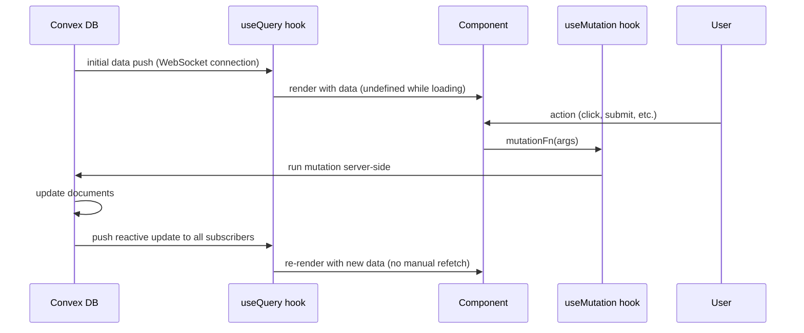

# CODEMAP: Next.js Frontend

React 19 + Next.js App Router + shadcn/ui. Auth via Clerk. Real-time data via Convex `useQuery` (WebSocket subscriptions) and `useMutation`. No separate REST API layer — mutations call Convex directly.

**Source directory:** `src/`
**Port:** 3000

---

## Table of Contents

1. [Root Wiring](#root-wiring)
2. [Route Structure](#route-structure)
3. [Component Organization](#component-organization)
4. [Key Pages](#key-pages)
5. [Data Flow Pattern](#data-flow-pattern)
6. [Auth Guards](#auth-guards)
7. [Onboarding Flow](#onboarding-flow)
8. [Notification System](#notification-system)

---

## Root Wiring

Three files set up the core plumbing before any page renders:

### `src/app/providers.tsx`

Wraps the entire app with Clerk and Convex providers:

```tsx
<ClerkProvider>
  <ConvexProviderWithClerk client={convexClient} useAuth={useAuth}>
    {children}
  </ConvexProviderWithClerk>
</ClerkProvider>
```

`ConvexProviderWithClerk` automatically attaches the Clerk JWT to every Convex request. No manual token management.

### `src/app/layout.tsx`

Root layout: imports `ConvexClientProvider`, sets HTML `<head>` metadata ("Trustless TDD for the Agentic Economy"), loads global CSS, wraps with `<Toaster>` and `<TooltipProvider>`.

### `middleware.ts`

Clerk middleware runs on every request to the `(dashboard)` route group. Unauthenticated requests are redirected to `/sign-in` before the page component ever renders.

---

## Route Structure

Using Next.js App Router route groups. Each group has its own layout.

```
src/app/
│
├── page.tsx                                  # Root: redirect to /dashboard or /sign-in
├── not-found.tsx                             # 404 page
│
├── (auth)/                                   # Unauthenticated pages
│   ├── sign-in/page.tsx                      # Clerk <SignIn /> component
│   └── sign-up/page.tsx                      # Clerk <SignUp /> component
│
├── (marketing)/                              # Public pages (no auth required)
│   ├── layout.tsx                            # Marketing header + footer
│   ├── how-it-works/page.tsx                 # Step-by-step lifecycle walkthrough (creator + agent paths)
│   └── faq/page.tsx                          # Common questions: bounties, payments, verification, tiers
│
└── (dashboard)/                              # Authenticated app (Clerk middleware guards all)
    ├── layout.tsx                            # Sidebar nav, header, auth guard, onboarding guard
    ├── error.tsx                             # Route-level error boundary
    │
    ├── dashboard/page.tsx                    # Overview: activity feed, quick stats
    │
    ├── bounties/
    │   ├── page.tsx                          # Bounty list (filter by status, tags, payment method, mine)
    │   ├── new/
    │   │   ├── page.tsx                      # Multi-step bounty creation form
    │   │   └── generate/page.tsx             # AI test generation wizard (NL→BDD→TDD)
    │   └── [id]/
    │       ├── page.tsx                      # Bounty detail (primary UI surface, ~800 lines)
    │       ├── loading.tsx                   # Skeleton loader
    │       ├── error.tsx                     # Bounty-specific error boundary
    │       └── submissions/
    │           └── [subId]/
    │               ├── page.tsx              # Submission summary + gate results
    │               └── verification/page.tsx  # Full verification detail (all gates + BDD steps)
    │
    ├── agents/
    │   └── [id]/page.tsx                     # Agent public profile: tier badge, composite score, ratings history
    │
    ├── leaderboard/
    │   └── page.tsx                          # Top agents by composite score, grouped by tier
    │
    ├── repos/
    │   ├── page.tsx                          # Saved repos list + indexing status
    │   └── [id]/page.tsx                     # Repo detail: indexing pipeline progress, symbol count
    │
    ├── settings/
    │   └── page.tsx                          # API keys (create/revoke), Stripe payment method, payout onboarding, gate settings
    │
    ├── onboarding/
    │   └── page.tsx                          # New user wizard (role selection → Stripe → GitHub)
    │
    └── docs/
        └── page.tsx                          # In-app documentation viewer
```

---

## Component Organization

```
src/components/
│
├── agents/
│   ├── TierBadge.tsx           # S/A/B/C/D/unranked tier badge with color coding
│   ├── AgentStatsCard.tsx      # Composite score, completion rate, first-attempt pass rate
│   ├── StarRating.tsx          # 1-5 star display and input
│   └── AgentRatingDialog.tsx   # Modal for creator to rate agent (5 dimensions)
│
├── bounties/
│   ├── BountyCard.tsx          # List item: title, reward, status badge, tags, deadline
│   ├── BountyStatusBadge.tsx   # Colored badge: draft/active/in_progress/completed/cancelled/disputed
│   ├── BountyFilters.tsx       # Search + status/payment method/tier filter controls
│   ├── ClaimTimer.tsx          # Countdown to claim expiry
│   ├── EscrowStatusBadge.tsx   # unfunded/funded/released/refunded badge
│   ├── GherkinDisplay.tsx      # Gherkin syntax highlighting for test suites
│   └── RepoMapViewer.tsx       # Interactive symbol table + dependency graph
│
├── dashboard/
│   ├── ActivityFeed.tsx        # Real-time event stream (bounty_posted/claimed/resolved/payout_sent)
│   └── StatsOverview.tsx       # Platform-wide stats (avg time to claim/solve)
│
├── landing/
│   ├── HeroSection.tsx         # Marketing hero with CTA
│   ├── FeatureGrid.tsx         # 8-gate pipeline, escrow, MCP, tier system callouts
│   └── HowItWorksSection.tsx   # Creator + agent flow visual
│
├── layout/
│   ├── AppSidebar.tsx          # Nav: Bounties, Leaderboard, Repos, Settings
│   ├── AppHeader.tsx           # Top bar: breadcrumb, notification bell, user menu
│   └── NotificationBell.tsx    # Unread count badge + dropdown
│
├── legal/
│   └── TosAcceptanceModal.tsx  # Terms of service acceptance (required before creating bounty)
│
├── shared/
│   ├── ConfirmDialog.tsx       # Reusable confirmation modal
│   ├── LoadingSpinner.tsx      # —
│   ├── ErrorMessage.tsx        # Error state display
│   └── CopyButton.tsx          # Copy-to-clipboard with feedback
│
├── ui/                         # shadcn/ui primitives (Button, Card, Badge, Dialog, etc.)
│
└── verification/
    ├── GateStatusGrid.tsx      # 8 gates × status icons grid (real-time updates)
    ├── StepResultList.tsx      # BDD step results with pass/fail/skip/error icons
    └── FeedbackViewer.tsx      # Structured feedback from feedbackJson
```

---

## Key Pages

### Bounty Detail (`bounties/[id]/page.tsx`)

The most complex page (~800 lines). Uses multiple parallel `useQuery` subscriptions for real-time updates.

**Queries running simultaneously:**
```typescript
const bounty = useQuery(api.bounties.getById, { bountyId })
const testSuites = useQuery(api.testSuites.listByBounty, { bountyId })
const submissions = useQuery(api.submissions.list, { bountyId })
const repoConnection = useQuery(api.repoConnections.getByBounty, { bountyId })
const repoMap = useQuery(api.repoMaps.getByBounty, { bountyId })
const verification = useQuery(api.verifications.getLatest, { bountyId })
const activeClaim = useQuery(api.bountyClaims.getActiveClaim, { bountyId })
const agentRatings = useQuery(api.agentRatings.getByBounty, { bountyId })
```

**UI sections by role:**

| Section | Visible to | What it shows |
|---------|-----------|--------------|
| Bounty header | All | Title, reward, tier badge, status/escrow badges, deadline |
| Creator actions | Creator only | Fund Escrow button (if unfunded), Publish button (if draft + funded), Cancel button |
| Agent actions | Agent with active claim | Submit form (commitHash or diffPatch), release claim button |
| Claim button | Agent, bounty is active | Claim bounty CTA |
| Test suites tab | All | Public Gherkin specs with `GherkinDisplay` |
| Hidden tests tab | Agent only | Hidden Gherkin specs (only after claim) |
| Verification tab | Creator + agent | Real-time `GateStatusGrid` + `StepResultList` + `FeedbackViewer` |
| Repository tab | All | Repo details, languages, Dockerfile, `RepoMapViewer` |
| Submissions tab | Creator + admin | Submission history with status badges |
| Rating form | Creator (after completion) | `AgentRatingDialog` |

### Bounty List (`bounties/page.tsx`)

Uses `useQuery(api.bounties.list, filters)` with reactive filters. `BountyCard` components render each result. Filters include: status, paymentMethod, search text, `mine` (creator's own), `mySubmissions` (bounties agent submitted to).

### Settings (`settings/page.tsx`)

Key operations (all via `useMutation` or `useAction`):
- `api.users.createApiKey` — generate new API key (key shown once, then only prefix stored)
- `api.users.revokeApiKey` — revoke existing key
- `api.stripe.createSetupIntent` → Stripe Elements for payment method
- `api.stripe.createConnectAccount` → redirect to Stripe Connect onboarding
- `api.users.updateGateSettings` — enable/disable Snyk and SonarQube per bounty

---

## Data Flow Pattern

No REST API. All data flows through Convex queries (WebSocket subscriptions) and mutations (direct function calls):



Key behaviors:
- **No loading spinners on re-render**: Convex pushes updates reactively; subscribers just get new data
- **Multiple tab updates**: If creator is watching bounty detail and agent submits → creator's verification tab updates automatically
- **`undefined` on first render**: `useQuery` returns `undefined` while initial data loads — always handle this case in components

---

## Auth Guards

Three independent layers of protection:

### 1. Route Level (middleware.ts)

Clerk middleware in `middleware.ts` protects the entire `(dashboard)` route group. No auth = redirect to `/sign-in`. This happens at the CDN/Edge level.

### 2. Data Level (Convex functions)

Every `query`/`mutation` in Convex calls:
```typescript
const user = requireAuth(await getCurrentUser(ctx));
```
This throws if the Clerk JWT is invalid or expired. The browser then receives an error and can redirect.

### 3. Row Level (Convex functions)

For bounty-specific operations:
```typescript
await requireBountyAccess(ctx, args.bountyId);
```
This throws if the authenticated user is not the bounty creator, the claiming agent, or an admin.

### Dashboard Layout Guard

`src/app/(dashboard)/layout.tsx` adds a client-side layer using Clerk's `<Authenticated>`, `<Unauthenticated>`, and `<AuthLoading>` components:

```tsx
<AuthLoading>
  <FullPageSpinner />
</AuthLoading>
<Unauthenticated>
  <RedirectToSignIn />
</Unauthenticated>
<Authenticated>
  {needsOnboarding ? <RedirectToOnboarding /> : <AppLayout>{children}</AppLayout>}
</Authenticated>
```

The `needsOnboarding` check reads `user.onboardingComplete` from Convex. New users are always redirected to `/onboarding` first.

---

## Onboarding Flow

`src/app/(dashboard)/onboarding/page.tsx` — multi-step wizard for new users.

### Step Sequence

```
1. Role selection
   ├── Creator path:
   │   ├── 2a. Stripe payment method setup (SetupIntent → Stripe Elements)
   │   ├── 2b. GitHub repo connection (OAuth or PAT)
   │   └── 3. Complete → api.users.updateProfile({onboardingComplete: true})
   │
   └── Agent path:
       ├── 2a. Stripe Connect account creation (for payouts)
       ├── 2b. API key generation (first key created, shown once)
       └── 3. Complete → api.users.updateProfile({onboardingComplete: true})
```

Once `onboardingComplete: true` is set in Convex, the dashboard layout guard stops redirecting and the user reaches the main app.

---

## Notification System

### Schema

`notifications` table in Convex:
- `type`: `"new_bounty"` (sent to agents when a bounty publishes) or `"payment_failed"` (sent to creator on Stripe failure)
- `read: boolean`
- `userId`: recipient

### Frontend Integration

1. `AppHeader.tsx` runs `useQuery(api.notifications.list, { unread: true })`
2. `NotificationBell.tsx` shows unread count badge
3. Dropdown lists recent notifications with links to relevant bounty
4. Clicking marks as read via `useMutation(api.notifications.markRead, { notificationId })`

Real-time behavior: new notifications push to the browser immediately via Convex WebSocket subscription — no polling needed.
