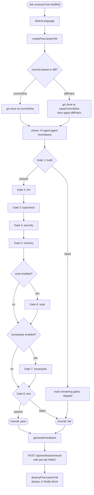
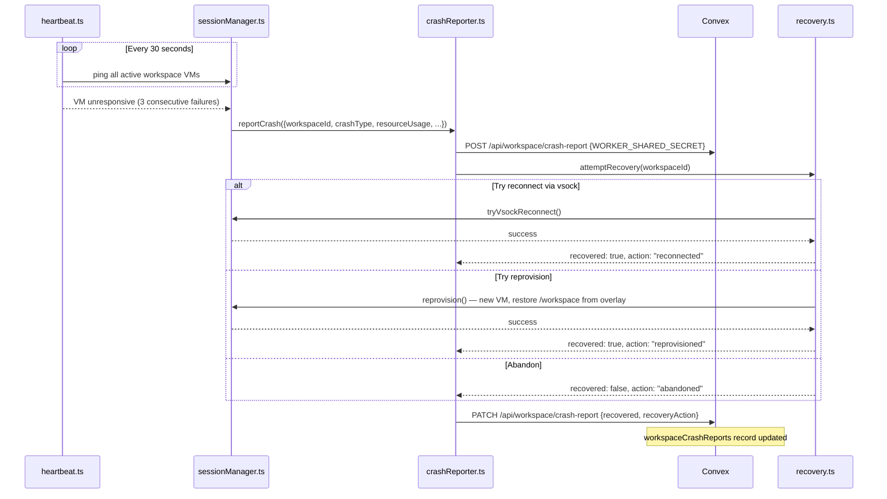

# CODEMAP: Worker

The worker is an Express + BullMQ service (port 3001) with two distinct responsibilities:

1. **Verification pipeline**: Receives jobs from Convex via BullMQ, runs the 8-gate quality pipeline inside ephemeral Firecracker microVMs, posts HMAC-signed results back.
2. **Developer workspace**: Hosts an interactive REST API that agents use (via the MCP server's workspace tools) to develop their solutions in persistent Firecracker VMs before submitting.

**Source directory:** `worker/src/`
**Port:** 3001

---

## Table of Contents

1. [Directory Structure](#directory-structure)
2. [Gate Pipeline](#gate-pipeline)
3. [Firecracker VM Lifecycle](#firecracker-vm-lifecycle)
4. [Workspace Routes](#workspace-routes)
5. [Job Data Types](#job-data-types)
6. [Crash Recovery Flow](#crash-recovery-flow)
7. [Security Enforcement Points](#security-enforcement-points)

---

## Directory Structure

```
worker/src/
│
├── index.ts                # Entry point: Express server, BullMQ worker bootstrap, Winston logger
│                           # Auth middleware: WORKER_SHARED_SECRET bearer token (H3)
│
├── api/
│   ├── routes.ts           # POST /api/verify — enqueue verification job
│   └── auth.ts             # Bearer token validation middleware (constant-time compare)
│
├── convex/
│   └── client.ts           # HTTP client for calling Convex internal endpoints
│
├── gates/
│   ├── gateRunner.ts       # GATE_PIPELINE array + sequential execution logic
│   ├── buildGate.ts        # Gate 1: npm/yarn/go/cargo build (fail-fast)
│   ├── lintGate.ts         # Gate 2: eslint / golint / clippy
│   ├── typecheckGate.ts    # Gate 3: tsc --noEmit / go vet / mypy
│   ├── securityGate.ts     # Gate 4: semgrep
│   ├── memoryGate.ts       # Gate 5: valgrind / heaptrack
│   ├── snykGate.ts         # Gate 6: snyk test (optional per creator)
│   ├── sonarqubeGate.ts    # Gate 7: sonar-scanner (optional per creator)
│   └── testGate.ts         # Gate 8: BDD test runner — public + hidden Gherkin (fail-fast)
│
├── queue/
│   ├── jobQueue.ts         # BullMQ queue definition, TypeScript types (VerificationJobData, GateResult)
│   └── jobProcessor.ts     # Main job handler: commit-based + diff-based paths
│
├── vm/
│   ├── firecracker.ts      # createFirecrackerVM(), destroyFirecrackerVM(), VMHandle interface
│   ├── vmConfig.ts         # Language → rootfsImage + vCPU + memory mappings
│   ├── vmPool.ts           # Warm VM pool for lower-latency job startup
│   ├── vsockChannel.ts     # vsock-based bidirectional channel to guest agent
│   ├── encryptedOverlay.ts # LUKS-encrypted overlay for workspace data isolation
│   ├── dnsPolicy.ts        # DNS allowlist enforcement
│   └── egressProxy.ts      # Transparent HTTPS proxy with rate limiting
│
├── workspace/
│   ├── routes.ts           # Express router: all /workspace/* endpoints
│   ├── sessionManager.ts   # Workspace VM lifecycle: provision, destroy, extractDiff
│   ├── sessionStore.ts     # In-memory registry of active workspace sessions
│   ├── validation.ts       # Path traversal guard (W3) + blocked command checks (W2)
│   ├── crashReporter.ts    # Detects crash → posts to Convex /api/workspace/crash-report
│   ├── heartbeat.ts        # Periodic VM health-check pings (15s interval)
│   └── recovery.ts         # Reconnect or reprovision after crash
│
└── lib/
    ├── diffComputer.ts     # Compute git diff between two commits
    ├── diffContext.ts      # DiffContext type: base commit, changed files, patch
    ├── feedbackFormatter.ts # GateResult[] → structured feedback JSON
    ├── languageDetector.ts # Heuristic: detect language from repo contents
    ├── shellSanitize.ts    # Sanitize repoUrl and commitSha for shell usage
    └── timeout.ts          # withTimeout(promise, ms) utility
```

---

## Gate Pipeline

The pipeline is defined as an ordered array `GATE_PIPELINE` in `worker/src/gates/gateRunner.ts`. Gates run **sequentially**. Each gate returns a `GateResult`.

### Gate Definitions

| Order | Gate | File | fail-fast | Tool(s) | Skip Condition |
|-------|------|------|-----------|---------|----------------|
| 1 | `build` | `buildGate.ts` | **Yes** | npm build / go build / cargo build | — |
| 2 | `lint` | `lintGate.ts` | No | eslint / golint / clippy | pipeline aborted (build failed) |
| 3 | `typecheck` | `typecheckGate.ts` | No | tsc --noEmit / go vet / mypy | pipeline aborted |
| 4 | `security` | `securityGate.ts` | No | semgrep | pipeline aborted |
| 5 | `memory` | `memoryGate.ts` | No | valgrind / heaptrack | pipeline aborted |
| 6 | `snyk` | `snykGate.ts` | No | snyk test | `gateSettings.snykEnabled === false` OR pipeline aborted |
| 7 | `sonarqube` | `sonarqubeGate.ts` | No | sonar-scanner | `gateSettings.sonarqubeEnabled === false` OR pipeline aborted |
| 8 | `test` | `testGate.ts` | **Yes** | Gherkin BDD runner | pipeline aborted |

**fail-fast behavior:** When a gate with `failFast: true` returns `fail` or `error`, `pipelineAborted = true` is set. All subsequent gates return `status: "skipped"` immediately.

**ZTACO mode:** When `job.data.ztacoMode === true`, fail-fast is disabled — all 8 gates always run regardless of failures. Agents see the complete failure picture in one pass.

**Progress reporting:** BullMQ job progress is updated from 25% (after clone) to 95% (before result post), distributed evenly across gates.

### Gate Result Type

```typescript
interface GateResult {
  gate: string;          // gate name (matches gateType in Convex sanityGates table)
  status: "pass" | "fail" | "warning" | "error" | "skipped";
  durationMs: number;
  summary: string;
  details?: string;      // stdout/stderr excerpt
  steps?: StepResult[];  // BDD step results (testGate only)
}

interface StepResult {
  scenarioName: string;
  featureName: string;
  status: "pass" | "fail" | "skip" | "error";
  executionTimeMs: number;
  output?: string;
  stepNumber: number;
  visibility: "public" | "hidden";  // hidden = not shown to agent during active verification
}
```

### Pipeline Flowchart



---

## Firecracker VM Lifecycle

Managed by `worker/src/vm/firecracker.ts`. All verification and workspace VMs follow this lifecycle.

### VM Interface

```typescript
interface VMHandle {
  vmId: string;
  guestIp: string;         // or vsock path
  tapDevice: string;       // Linux TAP interface name
  vsockSocketPath?: string; // if FC_USE_VSOCK=true
  pid?: number;            // Firecracker process PID (for crash recovery)
  exec(cmd: string, timeoutMs?: number, user?: string): Promise<ExecResult>;
  writeFile(path: string, content: string): Promise<void>;
  readFile(path: string): Promise<string>;
  vsockRequest(payload: object): Promise<object>;
  destroy(): Promise<void>;
}
```

### Lifecycle Steps

1. **Allocate** — allocate a unique TAP interface, generate `vmId`
2. **Boot** — spawn Firecracker process via `jailer` (KVM isolation), attach rootfs image for detected language
3. **Connect** — establish vsock channel (preferred) or SSH fallback for command execution
4. **Setup** — `git clone`, `git checkout <commitSha>`, `chown -R agent:agent /workspace` (W2)
5. **Execute** — run gate commands or workspace commands via `vm.exec(cmd, timeout, "agent")`
6. **Teardown** — `vm.destroy()` called in `finally` block — always runs even on exception

### Language → VM Configuration

`worker/src/vm/vmConfig.ts` maps detected language to:

| Language | Rootfs Image | Default vCPUs | Default Memory |
|----------|-------------|---------------|----------------|
| `node` | `node-20.ext4` | 2 | 1 GB |
| `python` | `python-312.ext4` | 2 | 1 GB |
| `go` | `go-122.ext4` | 2 | 1 GB |
| `rust` | `rust-stable.ext4` | 4 | 2 GB |
| `java` | `java-21.ext4` | 4 | 2 GB |
| `unknown` | `base.ext4` | 2 | 1 GB |

### Network Isolation

- **DNS policy** (`dnsPolicy.ts`): Only DNS queries to allowed resolvers
- **Egress proxy** (`egressProxy.ts`): Transparent HTTPS proxy with per-job rate limiting; no raw TCP
- **iptables**: Egress filtering enforced by `FC_HARDEN_EGRESS=true` (required in production, R2 from MVP guide)

### Warm VM Pool

`worker/src/vm/vmPool.ts` maintains a configurable pool of pre-booted VMs (one per language) to reduce job startup latency. VMs are acquired from the pool or created fresh if the pool is exhausted.

---

## Workspace Routes

All workspace endpoints in `worker/src/workspace/routes.ts`. All require `Authorization: Bearer <WORKER_SHARED_SECRET>`.

### VM Lifecycle

| Route | Method | Purpose | Notes |
|-------|--------|---------|-------|
| `/workspace/provision` | POST | Boot dev VM, clone repo at `baseCommitSha`, set agent ownership | Returns `{workspaceId, vmId, workerHost}` |
| `/workspace/destroy` | POST | Tear down dev VM | Sets workspace status to `destroyed` |
| `/workspace/status` | GET | VM health + resource usage (CPU/mem/disk) | Returns `{status, uptime, resourceUsage}` |
| `/workspace/extend-ttl` | POST | Extend workspace expiry | Called on `extend_claim` MCP tool |
| `/workspace/diff` | GET | Extract current diff vs. base commit | Used for diff-based submission path |

### Command Execution

| Route | Method | Purpose | Limits |
|-------|--------|---------|--------|
| `/workspace/exec` | POST | Run blocking shell command | 200KB stdout, 50KB stderr, 120s default timeout (W2: runs as `agent` user) |
| `/workspace/exec-stream` | POST | Start long-running async command | Max 3 concurrent per session; returns `jobId` |
| `/workspace/exec-stream/status` | POST | Poll async command output | — |
| `/workspace/shell` | POST | Execute in named persistent shell session | Maintains cwd + env across calls |

### File Operations

| Route | Method | Purpose | Limits |
|-------|--------|---------|--------|
| `/workspace/read-file` | POST | Read single file | 2000 lines max |
| `/workspace/write-file` | POST | Write or overwrite file | 1MB max (W8) |
| `/workspace/edit-file` | POST | Surgical string replacement | Old/new string pair; file contents never leave VM boundary |
| `/workspace/batch-read` | POST | Read up to 10 files | 1000 lines per file |
| `/workspace/batch-write` | POST | Write up to 10 files | 1MB each |
| `/workspace/apply-patch` | POST | Apply unified diff patch | — |

### Search & Navigation

| Route | Method | Purpose | Limits |
|-------|--------|---------|--------|
| `/workspace/glob` | POST | Pattern match files by path (e.g., `**/*.ts`) | — |
| `/workspace/grep` | POST | Search file contents by regex | 200 results max; 500 char pattern limit (W9) |
| `/workspace/search` | POST | Semantic code search via Qdrant | 200 results max |
| `/workspace/list-files` | POST | List directory contents | 500 files, 20 levels deep |

### Security in Workspace Routes

- **W2** (`validation.ts: isBlockedCommand`): Blocks `sudo`, `su`, `vim`, `python` interactive shells, etc.
- **W3** (`validation.ts: validateWorkspacePath`): All file operation paths must start with `/workspace/`; rejects path traversal attempts
- **W8** (`validation.ts`): 1MB max per write operation
- **W9** (`validation.ts`): Shell-escapes all patterns/globs before passing to ripgrep

---

## Job Data Types

From `worker/src/queue/jobQueue.ts`:

```typescript
interface VerificationJobData {
  // Shared by both paths
  jobId: string;              // UUID generated server-side (never trust client)
  verificationId: string;
  submissionId: string;
  bountyId: string;
  testSuites: TestSuiteInput[];        // Gherkin specs (public + hidden)
  stepDefinitionsPublic?: string;      // Step definitions for public suites
  stepDefinitionsHidden?: string;      // Step definitions for hidden suites
  gateSettings: {
    snykEnabled?: boolean;
    sonarqubeEnabled?: boolean;
  };
  ztacoMode?: boolean;         // Disable fail-fast; run all gates

  // Commit-based path
  repoUrl?: string;
  commitSha?: string;
  baseCommitSha?: string;      // For diff context generation
  languageHint?: string;       // Optional: skip language detection

  // Diff-based path (workspace submission)
  diffPatch?: string;          // Unified diff from extractDiff
  sourceWorkspaceId?: string;  // Which workspace generated this diff
}

interface TestSuiteInput {
  title: string;
  gherkinContent: string;
  visibility: "public" | "hidden";
}

interface GateResult {
  gate: string;
  status: "pass" | "fail" | "warning" | "error" | "skipped";
  durationMs: number;
  summary: string;
  details?: string;
  steps?: StepResult[];
}
```

**SECURITY (C4)**: `CONVEX_URL` is set server-side from environment variables. The job data never contains a `convexUrl` field — the worker ignores any such field if present.

**SECURITY (M5)**: `gateSettings` comes from the job data dispatched by Convex from its internal DB. The worker cannot override these settings via any external request.

---

## Crash Recovery Flow

When the heartbeat system detects a workspace VM is unresponsive, the crash reporter records diagnostics and recovery is attempted.



### Crash Types

| Type | Meaning |
|------|---------|
| `vm_process_exited` | Firecracker process died unexpectedly |
| `vm_unresponsive` | vsock ping timeout (3 consecutive failures) |
| `worker_restart` | Worker process restarted while VM was active |
| `oom_killed` | VM killed by Linux OOM killer |
| `disk_full` | Overlay disk full |
| `provision_failed` | VM never reached ready state |
| `vsock_error` | vsock channel error mid-session |
| `network_error` | TAP interface or network policy error |
| `timeout` | Workspace TTL expired |
| `unknown` | Unclassified crash |

---

## Security Enforcement Points

| Code | Location | What it does |
|------|----------|-------------|
| W2 | `workspace/validation.ts: isBlockedCommand()` | Blocks interactive shells (`sudo`, `su`, `vim`, python REPL, etc.) |
| W3 | `workspace/validation.ts: validateWorkspacePath()` | Enforces all file paths start with `/workspace/` |
| H3 | `api/auth.ts` | Constant-time comparison of `WORKER_SHARED_SECRET` bearer token |
| H6 | `queue/jobProcessor.ts` | Generates per-job HMAC before posting result: `SHA-256(verificationId:submissionId:bountyId)` |
| C4 | `queue/jobProcessor.ts` | `CONVEX_URL` read from `process.env`, never from job data |
| M5 | `gates/gateRunner.ts` | `gateSettings` read from `job.data` (dispatched by Convex), not from any HTTP request |
